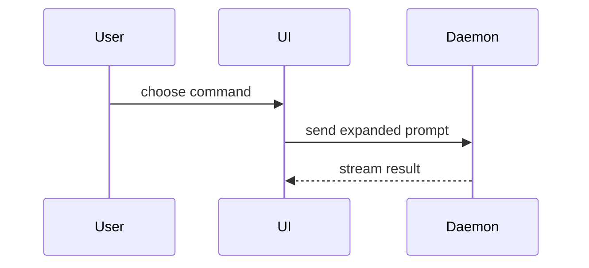

# Show Me

Explain the current topic visually. Skip the preamble and use only enough text to support the visual.

## Choose a format

Choose the smallest view that answers the user's question. Combine formats only when each adds useful information. Place each visual beside the text it explains.

Keep only the calls, files, props, states, and boundaries that matter to the question or decision.

### Logic and algorithms

Use pseudocode to show the steps:

```text
on(save)
  if content is unchanged
    return cached result
  write new content
  return fresh result
```

### Runtime control flow

Use a call tree to show which functions call others:

```text
submitForm
  createSession
    persistPrompt
    launchAgent
  navigateToSession
```

### UI structure

Use a component tree. Include relevant state and module boundaries:

```tsx
<SessionPage> (apps/example/src/routes/session.tsx)
  useSessionEvents()
  <SessionToolbar>
    <RunSkillButton> (packages/ui)
```

### File organization

Use a shallow file tree to show responsibilities or the scope of a refactor:

```text
src/
├── commands/       # parses user actions
├── sessions/       # owns session state
└── transport/      # sends API requests
```

### Interactions and data flow

Use Mermaid to show how components interact or pass data:



### Changes to an existing structure

Use `diff` when the reader needs to see what changes. Choose a component tree, file tree, call tree, or pseudocode to match the topic.

For a component change:

```diff
 <SessionPage>
   useSessionEvents()
   <SessionToolbar>
+    <RunSkillButton />
   <SessionTimeline>
+    <SkillResultCard />
```

For a file-layout change:

```diff
 src/
 ├── commands/
+│   └── show-me.ts       # expands the slash command
 ├── sessions/
-└── transport.ts
+└── transport/
+    ├── client.ts
+    └── stream.ts
```

For a call-tree or call-stack change:

```diff
 submitForm
   createSession
     persistPrompt
+    expandSkillMention
     launchAgent
-  navigateToSession
+  navigateToSession
+    subscribeToEvents
```

For a state or control-flow change:

```diff
 on(save)
-  write content
+  if content is unchanged
+    return cached result
+  write new content
+  invalidate cache
```

### Complete examples

Show the whole block when most of it is new or the reader needs a copyable example. Keep enough context to make ownership and order clear:

```ts
function expandSkill(command: string): string {
  const skillName = command.slice(1)
  return `use the ${skillName} skill`
}
```

## Create an HTML visual

Use one focused HTML file for UI layouts, state comparisons, or concepts too dense for Mermaid. Choose a diagram, infographic, or short slide deck to fit the topic.

Use real labels and data. Match the product's typography, spacing, components, and colors, with one exception: use a light theme unless the user asks for dark. Support desktop and mobile layouts.

If the project has a `plans/` folder, save the file there. Add the annotation runtime at the end of the body:

```html
<script src="http://127.0.0.1:4747/_show-me/annotate.js"></script>
</body>
```

Open the file through the notes server, never with plain `open`:

```
Bash(~/.claude/skills/show-me/assets/open.sh plans/show-me-{description}.html)
```

If the project keeps `plans/INDEX.md`, add a row as soon as you create the page under `plans/`. Include `live, show-me page; threads in <name>.notes.json` so the user and `/show-me reply` can find it.

## Answer annotation threads

The Notes panel lets the user hover over a block, press `+`, and start a thread. Threads are stored beside the page in `show-me-{description}.notes.json`. The page polls this file and displays updates live.

Check for pending threads when the user asks to answer notes, including `/show-me reply`, "reply to my notes", or "check the html". Also answer pending threads on a show-me page from the current conversation.

1. Find the pages with `ls -t plans/*.notes.json`. If needed, fall back to `**/*.notes.json` from the repository root. Find them yourself rather than asking the user which page.
2. List pending threads for each page with `node ~/.claude/skills/show-me/assets/notes.mjs list plans/show-me-{description}.html`. The output includes the thread ID, section, quoted block, and messages.
3. Unless the user named a specific page, include every page with pending threads. If none exist, say so in one line and stop.
4. If a thread requests a page change, edit the HTML before replying. Explain the change in your reply.
5. Reply to each pending thread through the command below. Keep replies short and match the page's voice. Backticks, `**bold**`, and fenced code are supported.
6. Summarize your answers in chat, one line per thread.

Pass reply text through stdin to preserve quoting:

```sh
printf '%s' "$reply" | node ~/.claude/skills/show-me/assets/notes.mjs reply plans/show-me-{description}.html <threadId>
```

Do not edit the notes JSON by hand or `resolve` threads yourself. The user decides when to resolve them.

Block anchors use `tag:hash(text)`. Threads stay attached when a block's text is unchanged, even if the page is regenerated. When you change a block's text, tell the user that its thread becomes detached and can be reattached from the panel.
