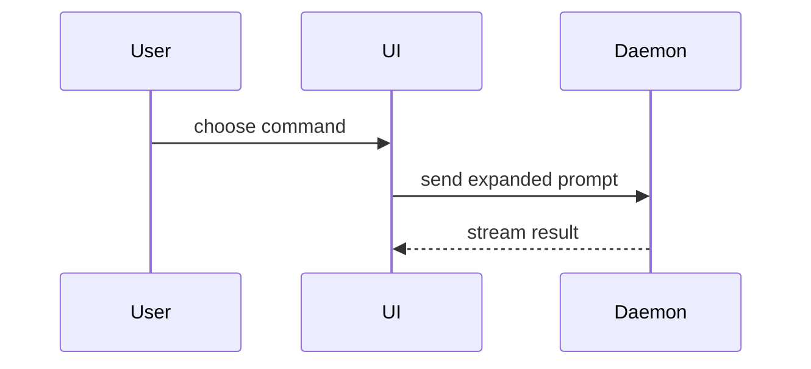

Help the user understand the current topic of conversation visually. Skip the preamble and keep prose brief. Pick the smallest view that makes the key point clear.

- Show logic or an algorithm as pseudocode:

```text
on(save)
  if content is unchanged
    return cached result
  write new content
  return fresh result
```

- Show runtime control flow as a call tree:

```text
submitForm
  createSession
    persistPrompt
    launchAgent
  navigateToSession
```

- Show UI structure as a component tree, including state and module boundaries that matter:

```tsx
<SessionPage> (apps/example/src/routes/session.tsx)
  useSessionEvents()
  <SessionToolbar>
    <RunSkillButton> (packages/ui)
```

- Show file responsibility or a broad refactor as a shallow file tree:

```text
src/
├── commands/       # parses user actions
├── sessions/       # owns session state
└── transport/      # sends API requests
```

- Show component interaction, control flow, or data flow with Mermaid:



- Use `diff` when the point is what changes and the surrounding shape already exists. Match the diff shape to the topic.

For a component change:

```diff
 <SessionPage>
   useSessionEvents()
   <SessionToolbar>
+    <RunSkillButton />
   <SessionTimeline>
+    <SkillResultCard />
```

For a file-layout change:

```diff
 src/
 ├── commands/
+│   └── show-me.ts       # expands the slash command
 ├── sessions/
-└── transport.ts
+└── transport/
+    ├── client.ts
+    └── stream.ts
```

For a call-tree or call-stack change:

```diff
 submitForm
   createSession
     persistPrompt
+    expandSkillMention
     launchAgent
-  navigateToSession
+  navigateToSession
+    subscribeToEvents
```

For a state or control-flow change:

```diff
 on(save)
-  write content
+  if content is unchanged
+    return cached result
+  write new content
+  invalidate cache
```

- Show the whole block when most of it is new, when omitted context would hide ownership or order, or when the user needs a copyable target shape:

```ts
function expandSkill(command: string): string {
  const skillName = command.slice(1)
  return `use the ${skillName} skill`
}
```

- For a visual UI, layout, state comparison, or concept too dense for Mermaid, write one focused HTML file — a diagram, an infographic, or a short slide deck, whichever fits the point. Match the product's colors, type, spacing, and components; use real labels and data; support desktop and mobile. Theme it light unless the user asks for dark, even when the subject is a dark-themed product. Put the file under `plans/` when the project has that folder. End the body with the annotation runtime, then open it through the notes server (never plain `open`):

```html
<script src="http://127.0.0.1:4747/_show-me/annotate.js"></script>
</body>
```

```
Bash(~/.claude/skills/show-me/assets/open.sh plans/show-me-{description}.html)
```

### notes (annotation threads)

Every HTML artifact opened this way gets a Notes panel: the user hovers a block, presses `+`, and starts a thread. Threads live in `show-me-{description}.notes.json` next to the page. The page polls that file, so anything written to it shows up live.

A page under `plans/` is a living artifact, not a throwaway: when the project keeps `plans/INDEX.md`, add one row for the page (`live, show-me page; threads in <name>.notes.json`, read by the human and by `/show-me reply`) the moment you write it.

When the user asks to answer their notes (`/show-me reply`, "reply to my notes", "check the html"), or when a show-me page from this conversation has pending threads:

0. Find the pages first; never ask the user which one. `ls -t plans/*.notes.json` (fall back to `**/*.notes.json` from the repo root), then `notes.mjs list` on each. Every page with a pending thread is in scope unless the user named one. No pending threads anywhere: say so in one line and stop.
1. `node ~/.claude/skills/show-me/assets/notes.mjs list plans/show-me-{description}.html` prints pending threads: id, section, quoted block, messages.
2. Answer each pending thread. Keep replies short, in the same voice as the page. Backticks, `**bold**` and fenced code render. Pipe the text through stdin so quoting never breaks:
   `printf '%s' "$reply" | node ~/.claude/skills/show-me/assets/notes.mjs reply plans/show-me-{description}.html <threadId>`
3. If a note asks for a change to the page, edit the HTML too, then reply describing the change. A block whose text changed shows the thread as detached; the user can re-attach it from the panel, so mention when that will happen.
4. Do not write the notes JSON by hand and do not `resolve` threads yourself; resolving is the user's call. Summarize in chat what you answered, one line per thread.

Block anchors are `tag:hash(text)`, so regenerating a page keeps threads attached wherever the block text is unchanged.

### guidance

Place each visual next to the short text it supports. Keep only the calls, files, props, states, and boundaries needed to answer the user's current question or the options to resolve the current discussion point.

You may use one of these, you may use several, it is unlikely you will use all of them. Use your judgement and don't overwhelm the user.
